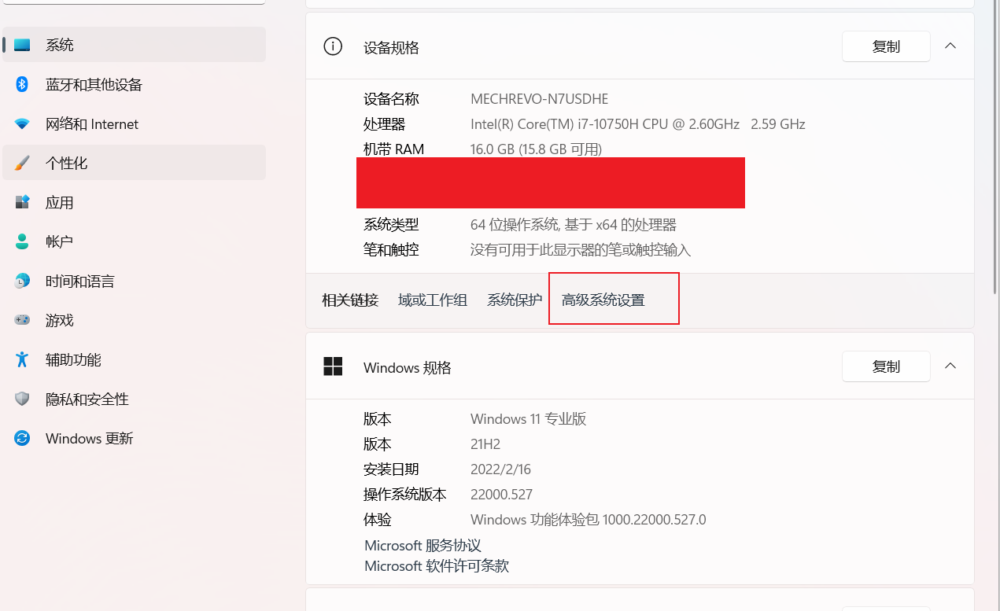
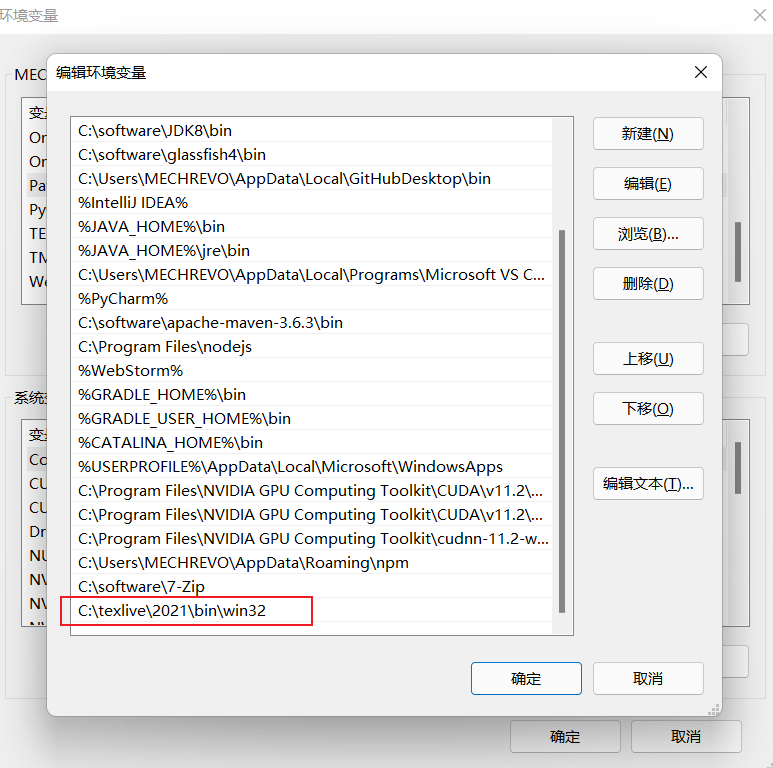
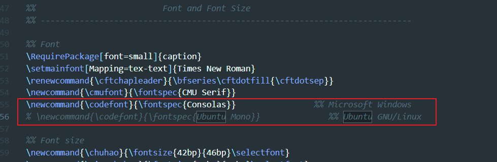
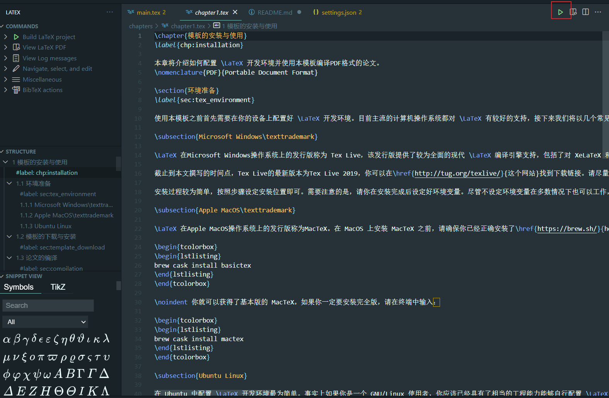
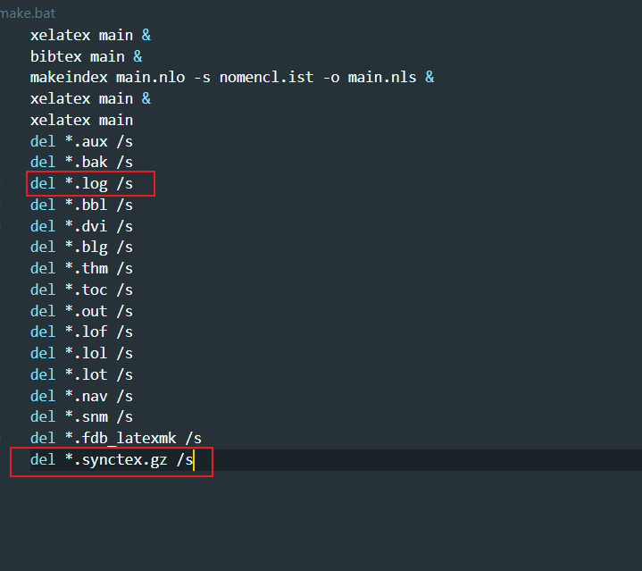
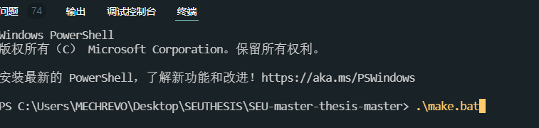

# 亲测可用，食用指南（WIndows11）
详细介绍使用师兄的[东南大学研究室论文模板](https://github.com/TouchFishPioneer/SEU-master-thesis)，点击即可进入下载。

你如果想省事，直接下载我的，只需要下载tex添加环境变量,安装字体就可以直接运行了。
## 下载TEX live
[阿里云TEX live 镜像](https://mirrors.aliyun.com/CTAN/systems/texlive/Images/)

[华为 TEX live 镜像](https://mirrors.huaweicloud.com/CTAN/systems/texlive/Images/)
### 安装
双击bat文件，install-tl-windows.bat -> 点击Customer --> 只有中文和英文的语言包，可以节省1G空间，如果不需要一直默认安装即可

大约等待20分钟左右，看个人电脑，2个小时内一般都能安装好。
### 环境变量
将你安装的tex中的bin，放到环境变量中，不会的自行百度（系统要找到.exe文件）。
我的是

结果如下：



## 下载字体并导入
字体下载
下载字体点 [这里]()  密码: agsv
安装字体:将解压文件移进>C:/windows>Font目录下即可。

## VScode工作环境设置：
```
{
    "latex-workshop.latex.autoBuild.run": "never",
    "latex-workshop.latex.recipes": [
        { 
            "name": "XeLaTex ➞ bibTex ➞ makeIndex ➞ 2*XeLaTex",
            "tools": [
                "XeLaTex",
                "bibTex",
                "makeIndex",
                "XeLaTex",
                "XeLaTex"
            ]
        },
        {
            "name": "latexmk 🔃",
            "tools": [
                "latexmk"
            ]
        },
        {
            "name": "pdflatex ➞ bibtex ➞ pdflatex × 2",
            "tools": [
                "pdflatex",
                "bibtex",
                "pdflatex",
                "pdflatex"
            ]
        }
    ],
    "latex-workshop.latex.tools": [
        { 
            "name": "XeLaTex",
            "command": "xelatex",
            "args": [
                "-synctex=1",
                "-interaction=nonstopmode",
                "-file-line-error",
                "%DOCFILE%.tex"
            ]
        },
        { 
            "name": "bibTex",
            "command": "bibtex",
            "args": [
                "%DOCFILE%.aux"
            ]
        },
        { 
            "name": "makeIndex",
            "command": "makeindex",
            "args": [
                "%DOCFILE%.nlo",
                "-s",
                "nomencl.ist",
                "-o",
                "%DOCFILE%.nls"
            ]
        },
        {
            "name": "latexmk",
            "command": "latexmk",
            "args": [
                "-synctex=1",
                "-interaction=nonstopmode",
                "-file-line-error",
                "-pdf",
                "-outdir=%OUTDIR%",
                "%DOC%"
            ],
            "env": {}
        },
        {
            "name": "pdflatex",
            "command": "pdflatex",
            "args": [
                "-synctex=1",
                "-interaction=nonstopmode",
                "-file-line-error",
                "%DOC%"
            ],
            "env": {}
        },
        {
            "name": "bibtex",
            "command": "bibtex",
            "args": [
                "%DOCFILE%"
            ],
            "env": {}
        }
    ],
    "latex-workshop.view.pdf.viewer": "tab",
    "editor.renderControlCharacters": true,
    "workbench.activityBar.visible": false,
    "workbench.statusBar.visible": false,
    "workbench.startupEditor": "newUntitledFile",
    "editor.minimap.enabled": false,
    "explorer.confirmDelete": false,
    "latex-workshop.latex.autoBuild.run": "never"
}
```
## 最后修改一个文件
seumasterthesis.cls中的,如下图所示，如果不修改会导致找不到字体


## 最后一步是运行
- 第一种方式：
点击运行，你需要到.tex文件下才会有这个按钮

如果能成功，就可以生成main.pdf,却该文件内容和manual.pdf一样

- 第二种方式
你需要修改 make.bat文件的内容，

最后在终端，命令行数据 .\make.bat

也可以运行成功
如果你不注释掉最后一行，你下次运行就会现实找不到这个文件，因为这个文件一开始就有的。
.log注释掉，是因为可以通过log查看错误出现在哪里。


## 参考文献将作者名修改成正常写法如下：
找到.bst文件中的
```
  #1 'uppercase.name :=
 ```
 修改成
 ```
 #0 'uppercase.name :=
 ```

# SEU-master-thesis

东南大学硕士研究生学位论文 LaTeX 模版。

## 简介

本模版基于许元的 [SeuThesis](http://seuthesis.googlecode.com/) 和樊智猛的 [SeuThesix](https://github.com/zhimengfan1990/seuthesix)，并在他们工作的基础上进行了修改以适应东南大学新的学位论文要求。本模板支持学术型硕士研究生和专业型硕士研究生学位论文。

本模版中参考文献部分的BST文件来自南京大学的胡海星同学提供的 [GB/T 7714-2015 BibTeX Style](https://github.com/CTeX-org/gbt7714-bibtex-style)，在此对他的工作表示感谢。

## 文档的编译

进行全文编译需要按照下述顺序调用编译引擎：

```
XeLaTeX -> BibTeX -> MakeIndex -> XeLaTeX -> XeLaTeX
```

为了方便文档编译，本模版也提供了自动化编译脚本。Windows 用户请执行根目录下的 make.bat 批处理文件，Linux 和 MacOS 用户请在命令行中执行根目录下的 make.sh 脚本。

此外，我们还在 3.4.3 版本后提供了对 GNU Make 的支持，使用类 Unix 操作系统的用户可以使用 make 命令执行自动化增量快速编译。

## 模版的使用

为了方便你快速上手本模版，我们撰写了一份针对本模版的使用手册，你可以阅读根目录下的 manual.pdf 文件以获取更多的模版使用方法和 LaTeX 使用技巧。此外，我们还提供了东南大学硕士研究生学位论文相关的说明文件以供参考，你可以在本模版的根目录下找到它们。它们分别是：

- 附件1：东南大学教务处和东南大学研究生院印发的《东南大学研究生学位论文格式规定》，该文档详细规定了硕士研究生撰写学位论文需要遵守的规则与注意事项；

- 附件2：东南大学研究生院印发的《学位论文独创性和使用授权声明》；

- 附件3：中华人民共和国国家质量监督检验检疫总局和中国国家标准化管理委员会印发的《中华人民共和国国家标准 GB/T 7714-2015 信息与文献 参考文献著录规则》，该规则规定了中文论文类文本中参考文献著录所需要遵守的规则。

## 更新历史

- __3.4.3__：添加了 Makefile 文件和 GNU Make 支持，并在手册中添加了相关说明。

- __3.4.1__：修正了专业型硕士研究生学位论文的相关设定和渲染格式，并在手册中添加了相关说明。

- __3.3.5__：调整了文献引用的格式；调整了 BST 文件的若干细节，使之符合东南大学研究生院参考文献引用标准。

- __3.3.3__：将一些专有名词从 CLS 文件中抽出并放置于 CFG 文件中，调整了 CFG 文件的结构；修正了论文A3封面书脊中西文混排时西文基线高度偏低的问题，并在手册中添加了相关介绍。

- __3.3.1__：添加了对专业型硕士研究生学位论文的支持；调整了表格框线的线型和边距。

- __3.2.5__：添加了对模板参数的介绍；添加了对子图的支持。

- __3.1.1__：舍弃了 CLS 文件的一些暴露参数；添加了 Windows 操作系统的编译脚本；撰写文档使用手册，正式开放源代码。

- __3.0.3__：调整了参考文献的格式，使其符合 GB/T 7714 - 2015 国家标准。

- __3.0.1__：大幅调整了 CLS 文件的结构与布局，取消了原模版对博士研究生学位论文的支持。

